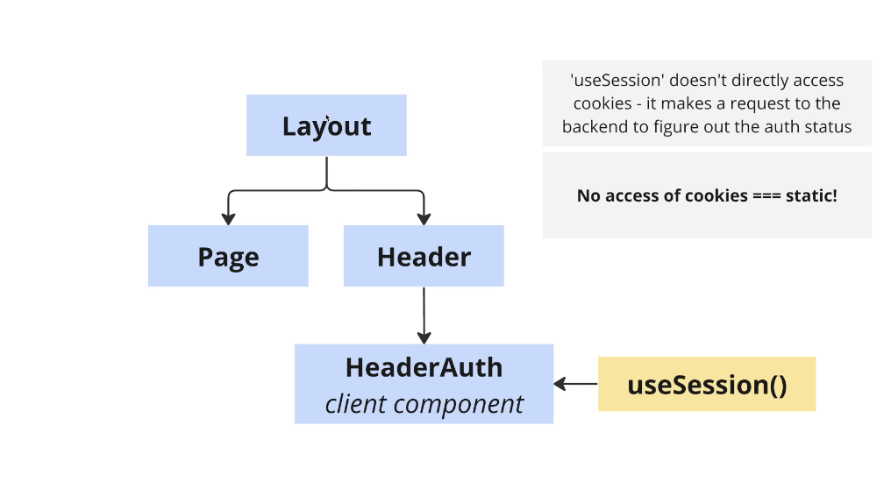
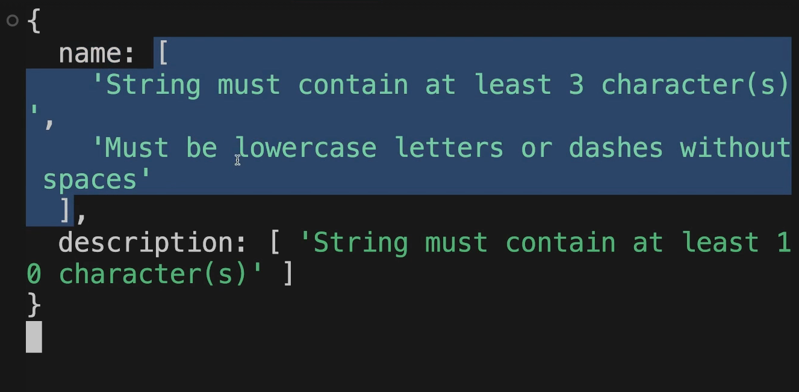

# section 07 Authentication


## 59. project overview
    - reddit clone
    - authentication
    - topics
    - comments

- Home


- create a topic


- view topic


- create a post


- view a post


## 60. npm libraries
- nextui
- prisma -> sqlite db
- next-auth -> authjs (renamed)
- github Oauth

## 61. nexui installation and setup
- package.json already has lib added from starter files
- framer-motion is required by nextui
- tailwind.config.ts

```ts
//...
import {nextui} from '@nextui-org/react';


export default {
  content: [
    //...
    './node_modules/@nextui-org/theme/dist/**/*.{js,ts,jsx,tsx}'
  ],
  theme: {
    extend: {
      colors: {
        background: "var(--background)",
        foreground: "var(--foreground)",
      },
    },
  },
  darkMode: "class",
  plugins: [nextui()],
} satisfies Config;

```

```tsx
//src/app/providers.tsx
'use client';

import {NextUIProvider} from '@nextui-org/react';

interface ProvidersProps{
    children: React.ReactNode
}

export default function Providers({children}:ProvidersProps){
    return <NextUIProvider>{children}</NextUIProvider>
}
```
- then add to src/app/layout.tsx

```tsx
import type { Metadata } from "next";
import { Inter } from "next/font/google";
import "./globals.css";
import  Providers from '@/app/providers';

const inter = Inter({ subsets: ["latin"] });

export const metadata: Metadata = {
  title: "Create Next App",
  description: "Generated by create next app",
};

export default function RootLayout({
  children,
}: {
  children: React.ReactNode;
}) {
  return (
    <html lang="en">
      <Providers>
        <body className={inter.className}>{children}</body>
      </Providers>
    </html>
  );
}

```

## 63. database setup


```sh
npx prisma init --datasource-provider sqlite
```

### create schema
- this creates the schema `prisma/schema.prisma`

### replace schema
- replace with the given schema.prisma from lesson 62 (given)
- it has data models:

- model Account
- model Session
- model User
- model VerificationToken
- model Topic
- model Post
- model Comment

### create db
- call this to create the db
- note the .env variable -> DATABASE_URL="file:./dev.db"
- give migration a name eg. `init`

```sh
npx prisma migrate dev
```

- this puts a dev.db in `prisma/`
- create src/db/index.ts

```ts
//src/db/index.ts
import {PrismaClient} from '@prisma/client';

export const db = new PrismaClient();

```

## 64. OAuth setup

- Auth Setup


- oauth flow


- steps 1-3
## 1. authentication will flow through [github oauth](http://github.com/settings/applications/new).

### create oauth app
    - create an OAuth App and generate a client_id and client_secret
    - Application name: Dev Discuss
    - Homepage URL: http://localhost:3000
    - Authorization callback URL: http://localhost:3000/api/auth/callback/github 
    - click -> Register application

### generate client ID / secret
    - generates Client ID
    - generate a new client Secret


## 2. .env.local file
- create in root: `.env.local`
- AUTH_SECRET is random string of letters you choose

```
GITHUB_CLIENT_ID=""
GITHUB_CLIENT_SECRET=""
AUTH_SECRET=""

```

## 3. install npm packages
- tutorial use exact version

```sh
npm install --save-exact @auth/core@0.18.1 @auth/prisma-adapter@1.0.6 next-auth@5.0.0-beta.3
```

## 65. Next-Auth Setup
## 4. make a auth.ts in src/ and setup NextAuth and PrismaAdapter in there

- inside schema.prisma -> models automatically used by `PrismaAdapter`
    - model Account
    - model Session
    - model User 
    - model VerificationToken

- when signing up will need the specific User properties (see `prisma/schema.prima` model):
    name          String?
    email         String?   @unique
    emailVerified DateTime?
    image         String?
    accounts      Account[]
    sessions      Session[]

```ts
//src/auth.ts
import NextAuth from 'next-auth';
import Github from 'next-auth/providers/github';
import { PrismaAdapter } from '@auth/prisma-adapter';
import { db } from '@/db';

const GITHUB_CLIENT_ID = process.env.GITHUB_CLIENT_ID;
const GITHUB_CLIENT_SECRET = process.env.GITHUB_CLIENT_SECRET;

if (!GITHUB_CLIENT_ID || !GITHUB_CLIENT_SECRET) {
  throw new Error('Missing github oauth credentials');
}

export const {
  handlers: { GET, POST },
  auth,
  signOut,
  signIn,
} = NextAuth({
  adapter: PrismaAdapter(db),
  providers: [
    Github({
      clientId: GITHUB_CLIENT_ID,
      clientSecret: GITHUB_CLIENT_SECRET,
    }),
  ],
  callbacks: {
    // Usually not needed, here we are fixing a bug in nextauth
    async session({ session, user }: any) {
      if (session && user) {
        session.user.id = user.id;
      }
      return session;
    },
  },
});
```

## 66. The Theory Behind OAuth
- set up the `app/api/auth[...nextauth]/route.ts` file to handle the request between Githubs Servers and ours
- `route.ts` file inside app/ is special in that you can export `GET` and `POST` functions (implement API handlers inside Nextjs app)
- we usually use actionhandlers within our own apps. 
- we would use route.ts to create GET and POST for outside servers to access our app automatically (eg. github server) 
- will use GET, POST from nextAuth

```ts
// app/api/auth[...nextauth]/route.ts
export { GET, POST} from '@/auth'
```

- @3min33sec

- Oauth flow


- most of oauth flow is handled behind the scenes, we just need to make sure of the `Authorization callback url`

### Requests made by users browser
1. user clicks on sign up button
2. users browser causes request to backend (NEXT SERVER) 
3. we realise user is trying to signup, so we redirect to (github server WITH client_id)  
  - `github.com/login/oauth/authorize?client_id=123`
4. github asks user if they are OK sharing information with our app. if so they redirect back to our server
  - callback url from github auth setup
  - `localhost:3000/api/auth/github/callback?code=456`

### Communication between (our server) and (github)
5. our server takes 'code' off request and makes a follow up request to Github
  - `github.com/login/oauth/access_token` `{clientId, clientSecret, code}`
6. github makes sure the {clientD, clientSecret and code} are valid then responds with an "access_token"
7. if valid responds with access_token
  - `access_token=abc123`
8. we make another request with the access_token to get details about the user (name, email etc)
  - `api.github.com/user` `Authorization: Bearer abc123`
9. github responds with the user's profile
  {name, email, avatar}
10. we create a new "User" record in the database
11. we send a cookie back to the users browser which will be included with all future requests automatically. That cookie tells us who is making a request to our server

## 67. wrapping auth in Server Actions
- make server actions to signin/signout the user (optional)
- `src/actions/index.ts`

```ts
// src/actions/index.ts

'use server';

import * as auth from '@/auth';

export async function signIn(){
    return auth.signIn('github');   //passin what provider we want to signin with
}

export async function signOut(){
    return auth.signOut();
}
```

## 68. sign-in, sign-out, check auth status

- actions


### sign in
- app/page.tsx 
- wrap button with form
- clicking on submit you will be taken to a page asking for authorization of your user account with authorization just created.

### Sign out
- if you want to sign out user, create a form and wrap the button for sign out

```ts
//app/pages.tsx
import {Button} from '@nextui-org/react';
import * as actions from '@/actions';
import {auth} from '@/auth';

export default async function Home() {
  const session = await auth();

  return (
    <div>
      <form action={actions.signIn}>      
        <Button type="submit">sign in</Button>
      </form>
      <form action={actions.signOut}>      
        <Button type="submit">sign out</Button>
      </form>

      {session?.user ? <div>{JSON.stringify(session.user)}</div>: <div>signed out</div>}

    </div>
  );
}

```
### try and access users authentication status - from server component
- see code (above)
- import {auth} from '@/auth';
- const session = await auth();
- {session?.user ? <div>{JSON.stringify(session.user)}</div>: <div>signed out</div>}

### try and access users authentication status - from client component
- requires a 'SessionProvider' to be set up in the 'providers.tsx' file
- using react context to share information about whether user is signed in (throughout all client components in our app)

```tsx
//src/app/providers.tsx
'use client';

import {NextUIProvider} from '@nextui-org/react';
import { SessionProvider } from 'next-auth/react';

interface ProvidersProps{
    children: React.ReactNode
}

export default function Providers({children}:ProvidersProps){
    return (
    <SessionProvider>
        <NextUIProvider>{children}</NextUIProvider>
    </SessionProvider>)
}
```

```tsx
//src/components/profile.tsx
'use client';

import {useSession} from 'next-auth/react';


export default function Profile(){
    const session = useSession();

    if(session.data?.user){
        return <div>From client: {JSON.stringify(session.data.user)}</div>
    }

    return <div>from client: user is NOT signed in</div>
}
```

### import Profile component
- import Profile from '@/components/profile';

```ts
//app/pages.tsx
import {Button} from '@nextui-org/react';
import * as actions from '@/actions';
import {auth} from '@/auth';
import Profile from '@/components/profile';

export default async function Home() {
  const session = await auth();

  return (
    <div>
      <form action={actions.signIn}>      
        <Button type="submit">sign in</Button>
      </form>
      <form action={actions.signOut}>      
        <Button type="submit">sign out</Button>
      </form>

      {session?.user ? <div>{JSON.stringify(session.user)}</div>: <div>signed out</div>}

      <Profile/>
    </div>
  );
}

```
## test
- `npm run dev`
- http://localhost:3000

## 69. upfront design process


1. identify all the different routes you want your app to have + the data that each shows


## 70. Why Path Helpers?
2. make 'path helper' functions
- path helpers -> make it easy to edit links, because with them, your paths arent in each page

- without path helpers


- path helpers


- with path helper, you're just passing in as a slug to the path helper the part of link thats unique for the path
```ts
postCreatePath(slug: string){
  return `/topics/${slug}/posts/neW`
}
```


- then calling the path is easier to edit and call and less error prone
```tsx
<Link href={paths.postCreatePath(topic.slug)}>create</Link>
```

## 71. Path Helper Implementation
-src/paths/ts

```ts
//src/paths/ts
const paths = {
    homePath(){
        return '/'
    },

    topicShow(topicSlug:string){
        return `/topics/${topicSlug}/`
    },

    postCreate(topicSlug:string){
        return `/topics/${topicSlug}/posts/new`
    },

    postShow(topicSlug:string, postId:string){
        return `/topics/${topicSlug}/posts/${postId}`
    }
}

export default paths;

```

## 72. Creating the Routing Structure
3. create your routing folders + page.tsx files based on step #1
- creating the files/folders for the path

  - /
  - /topics/[slug]/page.tsx
  ```tsx
  //page.tsx
  export default function TopicShowPage(){
    return <div>topic show</div>
  }
  ```

  - /topics/[slug]/posts/new

  ```tsx
  //page.tsx
  export default function PostCreatePage(){
    return <div>post create page</div>
  }
  ```

  - /topics/[slug]/posts/[postId]

  ```tsx
  //page.tsx
  export default function PostShowPage(){
    return <div>post show page</div>
  }
  ```

  


## 73. Stubbing Out Server Actions
4. identfy the places where data changes in your app
- create server actions for places where i can change data
5. make empty server actions for each of those

## 74. Planning Revalidating Strategies
6. add in comments on what paths you'll need to revalidate each server action 

- src/actions/create-comments.ts

```ts
'use server';
export async function createComments(){
    //TODO: revalidate post show page 
}
```

- src/actions/create-posts.ts
```ts
'use server';

export async function createPosts(){
    //TODO: revalidate the topic show page
}
```
- src/actions/create-topics.ts
```ts
'use server';

export async function createTopics(){
  //TODO: revalidate homepage
}
```

## 75. Building the Header
- making components for the header
- TODO: Header
- header has logo, search, signin/signup button (Oauth flow)
- once logged in, show github profile pic and signout butotn


## 76. Displaying the Sign In and Sign Out Buttons

- also need to determine if we are authenticated (from a server component) RECALL:
  - import {auth } from '@/auth';
  - const session = await auth();


- //components/header.tsx

```tsx
import Link from 'next/link';
import {auth } from '@/auth';

import {
    Navbar,
    NavbarBrand,
    NavbarContent,
    NavbarItem,
    Input,
    Button,
    Avatar
} from '@nextui-org/react';

export default async function Header(){
    const session = await auth();

    let authContent: React.ReactNode;
    if(session?.user){
      authContent = <Avatar src={session.user.image || ''}/>
    }else{
      authContent = <div>Signin/signup</div>
    }

    return (
        <Navbar className="shadow mb-6">
            <NavbarBrand>
                <Link href="/" className="font-bold">Discuss</Link>
            </NavbarBrand>
            <NavbarContent justify="center">
                <NavbarItem>
                    <Input/>
                </NavbarItem>
            </NavbarContent>
            <NavbarContent justify="end">
                <NavbarItem>
                    {
                        authContent
                    }
                </NavbarItem>
            </NavbarContent>
        </Navbar>
    );
}
```
## 77. enabling signout /signin
- calling our server actions
- wrap button with form
- components/header.tsx

```ts
import * as actions from '@/actions';

//...
//components/header.tsx
import Link from 'next/link';
import {auth } from '@/auth';
import * as actions from '@/actions';

import {
    Navbar,
    NavbarBrand,
    NavbarContent,
    NavbarItem,
    Input,
    Button,
    Avatar,
    Popover,
    PopoverTrigger,
    PopoverContent
} from '@nextui-org/react';

export default async function Header(){
    const session = await auth();
    let authContent: React.ReactNode;
    if(session?.user){
      authContent = 
        <Popover placement="left">
            <PopoverTrigger>
                <Avatar src={session.user.image || ''}/>
            </PopoverTrigger>
            <PopoverContent>
                <div className="p-4">
                    <form action={actions.signOut}>
                        <Button type="submit">Sign out</Button>
                    </form>
                </div>
            </PopoverContent>
        </Popover>
    
    }else{
      authContent = <>
        <NavbarItem>
            <form action={actions.signIn}>
                <Button type="submit" color="secondary" variant="bordered">
                    sign in
                </Button>
            </form>
        </NavbarItem>
        <NavbarItem>
            <form action={actions.signOut}>
                <Button type="submit" color="primary" variant="flat">
                    sign up
                </Button>
            </form>
        </NavbarItem>
      </>
    }

    return (
        <Navbar className="shadow mb-6">
            <NavbarBrand>
                <Link href="/" className="font-bold">Discuss</Link>
            </NavbarBrand>
            <NavbarContent justify="center">
                <NavbarItem>
                    <Input/>
                </NavbarItem>
            </NavbarContent>
            <NavbarContent justify="end">
              {
                authContent
              }
            </NavbarContent>
        </Navbar>
    );
}
```

## 78. more cache issues
- build result is that everything is dynamic... why?
   - because everypage is wrapped by 'layout' and layout calls auth `const session = await auth()` 
   - nextauth will read/access/modify cookies inside of the request 
   - therefore every route that includes the header will be marked during build as dynamic


## 79. static caching while using auth


### FIX changing the header (make page static)
- TODO: adjust code so we can still use header in layout and header can still use authentication (handle cookies) but make page static at buildtime
- FIX: move auth to client component (HeaderAuth) that will handle authentication via useSession() hook
- useSession() does not handle cookies/ directly access cookies -> it makes a request to the backend to figure out the auth status.




- components/header-auth.tsx
- because it is a client component, we use useSession() hook

```ts
//components/header-auth.tsx
'use client';

import Link from 'next/link';
import * as actions from '@/actions';
// import {auth } from '@/auth';
import {useSession} from 'next-auth/react';

import {
    Navbar,
    NavbarBrand,
    NavbarContent,
    NavbarItem,
    Input,
    Button,
    Avatar,
    Popover,
    PopoverTrigger,
    PopoverContent
} from '@nextui-org/react';

export default function HeaderAuth(){
    //figure authentication
    const session = useSession();
    let authContent: React.ReactNode;

    if(session.status === "loading"){
        authContent === null;
    }
    else if(session.data?.user){
        authContent = 
          <Popover placement="left">
              <PopoverTrigger>
                  <Avatar src={session.data.user.image || ''}/>
              </PopoverTrigger>
              <PopoverContent>
                  <div className="p-4">
                      <form action={actions.signOut}>
                          <Button type="submit">Sign out</Button>
                      </form>
                  </div>
              </PopoverContent>
          </Popover>
      
      }else{
        authContent = <>
          <NavbarItem>
              <form action={actions.signIn}>
                  <Button type="submit" color="secondary" variant="bordered">
                      sign in
                  </Button>
              </form>
          </NavbarItem>
          <NavbarItem>
              <form action={actions.signOut}>
                  <Button type="submit" color="primary" variant="flat">
                      sign up
                  </Button>
              </form>
          </NavbarItem>
        </>
      }

    return authContent;
}
```

```ts
//components/header.tsx
import Link from 'next/link';

import {
    Navbar,
    NavbarBrand,
    NavbarContent,
    NavbarItem,
    Input,
} from '@nextui-org/react';

import HeaderAuth from '@/components/header-auth';

export default function Header(){
    return (
        <Navbar className="shadow mb-6">
            <NavbarBrand>
                <Link href="/" className="font-bold">Discuss</Link>
            </NavbarBrand>
            <NavbarContent justify="center">
                <NavbarItem>
                    <Input/>
                </NavbarItem>
            </NavbarContent>
            <NavbarContent justify="end">
                <HeaderAuth/>
            </NavbarContent>
        </Navbar>
    );
}
```

### fixing when we load up and not sure of authentication state 
- session.status gives us 'loading' state when we arent sure whats the state yet when starting up.

```ts
if(session.status === "loading"){
      authContent === null;
  }
else {} 
```

## 80. creating topics
- TODO: ability to create topics
  - and posts inside a topic
  - topic creation should have validation


- components/topic/topic-create-form.tsx
- import into: app/page.tsx

## 81. creating a popover form

```tsx
//components/topics/topic-create-form.tsx

import {
    Input,
    Button,
    Textarea,
    Popover,
    PopoverTrigger,
    PopoverContent
} from '@nextui-org/react';
import * as actions from '@/actions';

export default function TopicCreateForm(){
    return (
        <Popover placement="left">
            <PopoverTrigger>
                <Button color="primary">Create a topic</Button>
            </PopoverTrigger>
            <PopoverContent>
                <form action={actions.createTopic}>
                    <div className="flex flex-col gap-4 p-4 w-80">
                        <h3 className="text-lg">create a topic</h3>
                        <Input name="name" label="Name" labelPlacement="outside" placeholder="Name"></Input>
                        <Textarea 
                            name="description"
                            label="Description" 
                            labelPlacement="outside" 
                            placeholder="Describe your topic"
                        />
                        <Button type="submit">Submit</Button>
                    </div>
                </form>
            </PopoverContent>
        </Popover>
    )
}
```

## 82. receiving form data
- give form inputs/textareas name properties
- then you can retrieve form values

```ts
//actions/create-topic.ts

'use server';

export async function createTopic(formData:FormData){
    const name = formData.get('name');
    const description = formData.get('description');

    console.log(name, description)
    //TODO: revalidate the homepage
}
```

## 83. adding validation with zod
- using zod
- z variable: `import {z} from 'zod'`
- to use zod we create a schema object -> which gives us a createTopicSchema `validator`

```ts
const createTopicSchema = z.object({
  name: z.string().min(3).regex(/a-z-/),
  description: z.string().min(10)
})
```

### installing zod
- pnpm i zod


### how zod validation works
- with createTopicSchema, we have access to safeParse() function which we can pass in data
  - if data is valid -> output is data property with the schema object's attributes
  - if data is invalid -> output is and error property with issues attribute (array)
- ts wants us to check on !result.success first..

```tsx
//actions/create-topic.ts
'use server';

import { z } from 'zod';


const createTopicSchema = z.object({
    name: z
        .string()
        .min(3)
        .regex(/^[a-z-]+$/, {
            message: 'must be lowercase letters or dashes without spaces'
        }),  //fixed regex expression
    description: z.string().min(10)
})

export async function createTopic(formData:FormData){
    const result = createTopicSchema.safeParse({
        name: formData.get('name'),
        description: formData.get('description')
    });

    if(!result.success){
        console.log(result.error.flatten().fieldErrors);
    }
}
```

- gives us errors like:

### difficult to map: result.error
- result.error


### easy to work with: result.error.flatten().fieldErrors
- result.error.flatten().fieldErrors
- returns a plain object that has the prop and its value array of errors for that named input
